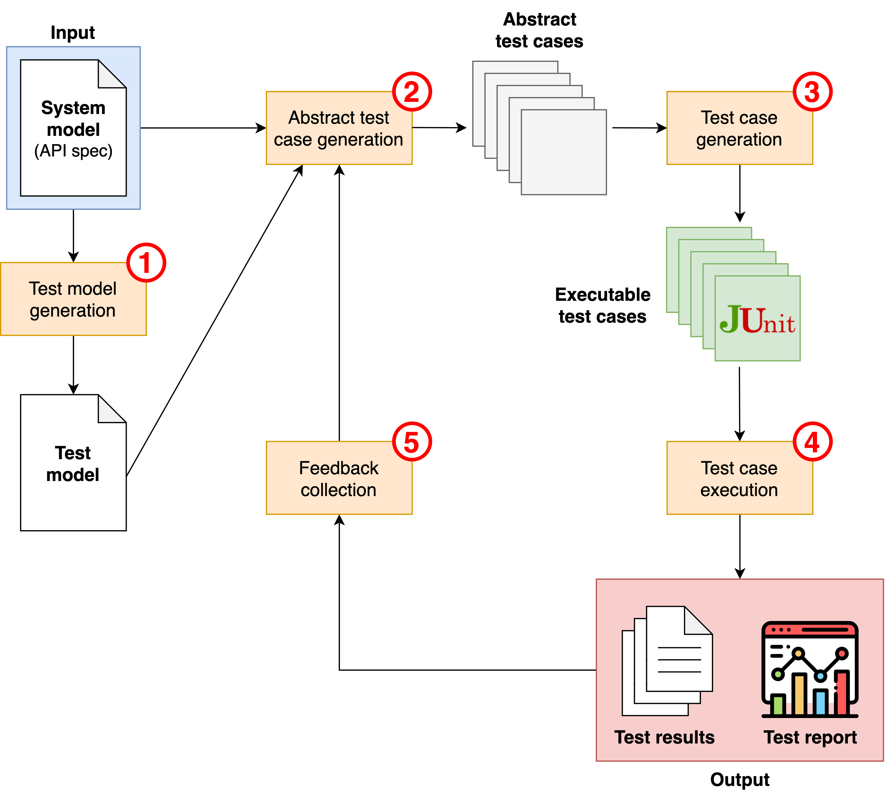
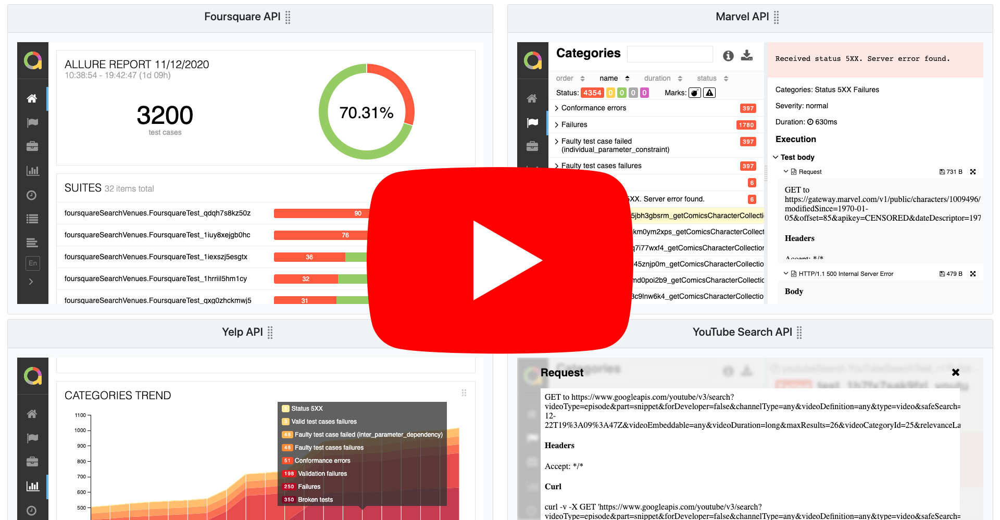
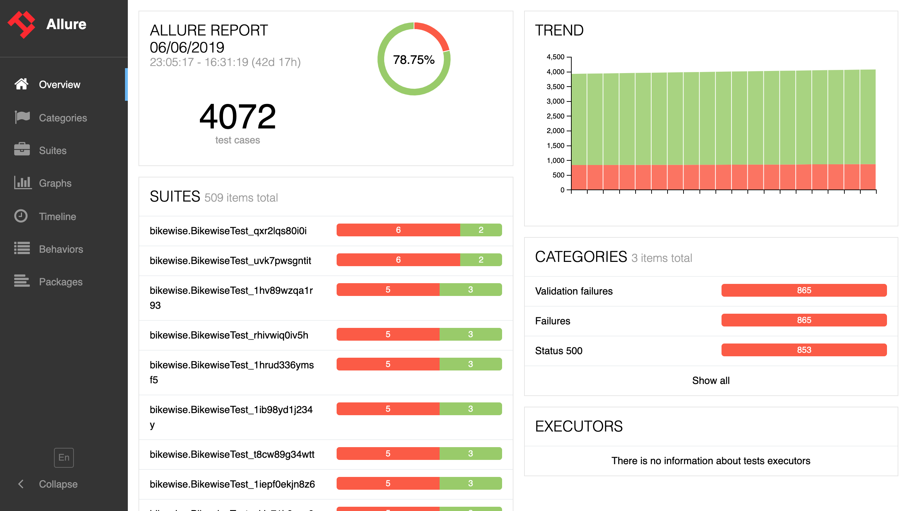

[](https://maven-badges.herokuapp.com/maven-central/es.us.isa/restest)
[](https://javadoc.io/doc/es.us.isa/restest)
[](https://circleci.com/gh/isa-group/RESTest)
[](https://sonarcloud.io/component_measures?id=isa-group_RESTest&metric=Coverage)
[](https://sonarcloud.io/component_measures?id=isa-group_RESTest&metric=Maintainability)
[](https://sonarcloud.io/component_measures?id=isa-group_RESTest&metric=Reliability)
[](https://sonarcloud.io/component_measures?id=isa-group_RESTest&metric=Security)

RESTest is a framework for automated black-box testing of RESTful web APIs. It follows a model-based approach, where test cases are automatically derived from the [OpenAPI Specification (OAS)](https://www.openapis.org/) of the API under test. No access to the source code is required, which makes it possible to test APIs written in any programming language, running in local or remote servers.

## RESTest: Your RESTful APIs. Tested. By robots.

The RESTest testing ecosystem comprehends a complete suite of tools for automatically testing and monitoring your APIs. Still testing your APIs manually? Stop it. Let our robots do the work.

<a href="https://youtu.be/-rydj3T_YjA" target="_blank"></a>

## Index
1. [RESTest Wiki](https://github.com/isa-group/RESTest#restest-wiki)
1. [How does it work?](https://github.com/isa-group/RESTest#how-does-it-work)
1. [What can I do with RESTest?](https://github.com/isa-group/RESTest#what-can-i-do-with-restest)
1. [Quickstart guide](https://github.com/isa-group/RESTest#quickstart-guide)
    1. [Setting up RESTest](https://github.com/isa-group/RESTest#setting-up-restest)
    1. [Generated test cases and test reports](https://github.com/isa-group/RESTest#generated-test-cases-and-test-reports)
1. [Running RESTest as a JAR](https://github.com/isa-group/RESTest#running-restest-as-a-jar)
    1. [Option 1: Build RESTest from source](https://github.com/isa-group/RESTest#option-1-build-restest-from-source)
    1. [Option 2: Download the latest release](https://github.com/isa-group/RESTest#option-2-download-the-latest-release)
1. [Citing RESTest](https://github.com/isa-group/RESTest#citing-restest)
1. [License](https://github.com/isa-group/RESTest#license)
    1. [Icon credits](https://github.com/isa-group/RESTest#icon-credits)

## RESTest Wiki
In this page you can find a brief description of how RESTest works and an illustrating example. If you want to read the full documentation, please visit the [Wiki](https://github.com/isa-group/RESTest/wiki). 

## How does it work?
The figure below shows how RESTest works:

1. **Test model generation**: RESTest takes as input the OAS specification of the API under test, considered the *system model*. A [*test model*](https://github.com/isa-group/RESTest/wiki/Test-configuration-files) is automatically generated from the system model including test-specific configuration data. The default test model can be manually enriched with fine-grained configuration details such as test data generation settings.

1. **Abstract test case generation**: The system and the test models drive the generation of abstract test cases following user-defined test case generation strategies such as random testing. If the API under test contains [inter-parameter dependencies](https://github.com/isa-group/RESTest/wiki/Inter-parameter-dependencies), then constraint-based testing can be applied, specifying the dependencies in the OAS specification using the IDL4OAS extension (see examples [here](https://github.com/isa-group/IDLReasoner/blob/master/src/test/resources/OAS_example.yaml#L45) and [here](https://github.com/isa-group/IDLReasoner/tree/master/src/test/resources)). Requests satisfying all inter-parameter dependencies are automatically generated thanks to [IDLReasoner](https://github.com/isa-group/IDLReasoner).

1. **Test case generation**: The abstract test cases are instantiated into a specific programming language or testing framework using a [test writer](https://github.com/isa-group/RESTest/wiki/Test-writers). RESTest currently supports the generation of [REST Assured](http://rest-assured.io/) and [Postman](https://www.postman.com/) test cases.

1. **Test case execution**: The test cases are executed and a set of reports and stats are generated. Stats are machine-readable, and the test reports can be graphically visualized thanks to [Allure](http://allure.qatools.ru/).

1. **Feedback collection**: [Test case generators](https://github.com/isa-group/RESTest/wiki/Test-case-generators) and other components can react to the test outputs (i.e., the stats generated in the previous step) to create more sophisticated test cases. Examples of this are the stateful data generators (e.g., the [BodyGenerator](https://github.com/isa-group/RESTest/blob/master/src/main/java/es/us/isa/restest/inputs/stateful/BodyGenerator.java)) and the [StatsReportManager](https://github.com/isa-group/RESTest/blob/master/src/main/java/es/us/isa/restest/reporting/StatsReportManager.java), both of which generate new test data based on previous API responses.



## What can I do with RESTest?
Check out the following demo video, where we discuss some of the things that you can do with RESTest, both from the user and the developer point of view. The showcase shown in the video is available at http://betty.us.es/restest-showcase-demo/.

<a href="https://youtu.be/TnGkwMDBDt4" target="_blank"></a>

## Quickstart guide
To get started with RESTest, download the code and move to the parent directory:
````
git clone https://github.com/isa-group/RESTest.git
cd RESTest
````

### Installing local dependencies
RESTest relies on two libraries located in the `lib/` folder. To install them, simply run the following command from the parent directory (i.e., `RESTest/`):
```
./scripts/install_dependencies.sh
```

### Setting up RESTest

Let's try RESTest with some API, for example, [RESTCountries](https://restcountries.eu/). Follow these steps:

1. **Get the OAS specification of the API under test**. For RESTCountries, it is available at the following path: `src/test/resources/Restcountries/openapi.yaml`.

2. **Generate the test configuration file**. From the OAS spec, we can automatically generate the [test configuration file](https://github.com/isa-group/RESTest/wiki/Test-configuration-files). To do so, edit [the following line of CreateTestConf](https://github.com/isa-group/RESTest/blob/master/src/main/java/es/us/isa/restest/main/CreateTestConf.java#L22) to set the path to the OAS spec. Then, run the [CreateTestConf](https://github.com/isa-group/RESTest/blob/master/src/main/java/es/us/isa/restest/main/CreateTestConf.java) class, located under the `es.us.isa.restest.main` package.

````java
private static String openApiSpecPath = "src/test/resources/Restcountries/openapi.yaml"; // OAS file path
````

3. **(Optional) Modify the test configuration file to tailor your needs**. For example, you can remove some operations you are not interested to test. For more info, visit the [Wiki](https://github.com/isa-group/RESTest/wiki/Test-configuration-files). **NOTE: An already set up test configuration file can be found at `src/test/resources/Restcountries/fullConf.yaml`.**

4. **Configure RESTest execution**. To set things like number of test cases to generate, testing technique, etc., you need to create a [RESTest configuration file](https://github.com/isa-group/RESTest/wiki/RESTest-configuration-files). You can find the RESTest configuration file for the RESTCountries API at `src/test/resources/Restcountries/restcountries_demo.properties`. With this configuration, a total of 132 test cases will be generated in three iterations, without delay between them, and the test outputs and reports will be stored under the folders `target/<type_of_data>/restcountries`. **NOTE: If you set `generator=FT`, you can completely omit steps 2. and 3., as you will be performing *fuzzing*, which does not require setup at all.**

```properties
# ADD HERE ANY EXTRA INFORMATION TO BE DISPLAY IN THE TEST REPORT

# API name
api=Restcountries

# CONFIGURATION PARAMETERS

# Test case generator
generator=CBT

# Number of test cases to be generated per operation on each iteration
testsperoperation=2

# OAS specification
oas.path=src/test/resources/Restcountries/openapi.yaml

# Test configuration file
conf.path=src/test/resources/Restcountries/fullConf.yaml

# Directory where the test cases will be generated
test.target.dir=src/generation/java/restcountries

# Package name
test.target.package=restcountries

# Experiment name (for naming related folders and files)
experiment.name=restcountries

# Name of the test class to be generated
testclass.name=RestcountriesTest

# Measure input coverage
coverage.input=true

# Measure output coverage
coverage.output=true

# Enable CSV statistics
stats.csv=true

# Maximum number of test cases to be generated
numtotaltestcases=132

# Optional delay between each iteration (in seconds)
delay=-1

# Ratio of faulty test cases to be generated (negative testing)
faulty.ratio=0.5

# CONFIGURATION SETTINGS FOR CONSTRAINT-BASED TESTING

# Ratio of faulty test cases to be generated due to broken dependencies.
faulty.dependency.ratio=0

# Number of test cases after which new test data will be loaded.
reloadinputdataevery=100

# Max number of data values for each parameter
inputdatamaxvalues=1000
```

5. **Run RESTest**. Edit [the following line of TestGenerationAndExecution](https://github.com/isa-group/RESTest/blob/master/src/main/java/es/us/isa/restest/main/TestGenerationAndExecution.java#L41) to set the path to the RESTest configuration file. Then, run the [TestGenerationAndExecution](https://github.com/isa-group/RESTest/blob/master/src/main/java/es/us/isa/restest/main/TestGenerationAndExecution.java) class, located under the `es.us.isa.restest.main` package.

````java
private static String propertiesFilePath = "src/test/resources/Restcountries/restcountries_demo.properties";
````

### Generated test cases and test reports

RESTest generates REST Assured test cases like the following one:

```java
@Test
public void test_1jidbvas4d6ph_v2Name() {
	String testResultId = "test_1jidbvas4d6ph_v2Name";

	nominalOrFaultyTestCaseFilter.updateFaultyData(false, true, "none");
	statusCode5XXFilter.updateFaultyData(false, true, "none");
	csvFilter.setTestResultId(testResultId);
	statusCode5XXFilter.setTestResultId(testResultId);
	nominalOrFaultyTestCaseFilter.setTestResultId(testResultId);
	validationFilter.setTestResultId(testResultId);

	try {
		Response response = RestAssured
		.given()
			.log().all()
			.queryParam("fullText", "true")
			.queryParam("fields", "subregion")
			.pathParam("name", "Qatar")
			.filter(allureFilter)
			.filter(statusCode5XXFilter)
			.filter(nominalOrFaultyTestCaseFilter)
			.filter(validationFilter)
			.filter(csvFilter)
		.when()
			.get("/v2/name/{name}");

		response.then().log().all();
		System.out.println("Test passed.");
	} catch (RuntimeException ex) {
		System.err.println(ex.getMessage());
		fail(ex.getMessage());
	}
}
```

This test case makes a GET request to the endpoint `/v2/name/{name}` with several query and path parameters. Then it asserts that:
  - The status code is not 500 or higher, which would reveal a server error (`statusCode5XXFilter`).
  - The status code is in the range 2XX if the request is valid or 4XX if the request is faulty (`nominalOrFaultyTestCaseFilter`).
  - The response conforms to the OAS specification of the API (`validationFilter`).

Finally, test failures are collected and they can be easily spotted and analyzed in a user-friendly GUI, built with [Allure](http://allure.qatools.ru/). To do so, open the file `target/allure-reports/restcountries/index.html` in your browser:



## Running RESTest as a JAR
Instead of from an IDE like IntelliJ IDEA, you can also run RESTest as a fat JAR. You have two options:

### Option 1: Build RESTest from source

To package RESTest as a fat JAR file, run the following command in the root directory:

```
mvn clean install -DskipTests
```

Then, run the JAR file passing as argument the path to the properties file, for example:

```
java -jar target/restest-full.jar src/test/resources/Restcountries/restcountries_demo.properties
```

### Option 2: Download the latest release

Go to the [releases page](https://github.com/isa-group/RESTest/releases) and download the latest one. RESTest releases consist of ZIP files which, once uncompressed, provide the directory structure and the necessary resources to run RESTest as a JAR. You can test the same example shown in the quickstart guide by running the following command:

```
java -jar restest.jar src/test/resources/Folder/api.properties
```

## Citing RESTest

If you want to cite RESTest in your research, please use the BibTeX entry below. [Here's a link to a preprint of the paper](https://www.researchgate.net/publication/352835570_RESTest_Automated_Black-Box_Testing_of_RESTful_Web_APIs).


```bibtex
@inproceedings{MartinLopez2021Restest,
	title= {{RESTest: Automated Black-Box Testing of RESTful Web APIs}},
	author= {Alberto Martin-Lopez and Sergio Segura and Antonio Ruiz-Cort\'{e}s},
	booktitle= {Proceedings of the 30th ACM SIGSOFT International Symposium on Software Testing and Analysis},
	series= {ISSTA '21},
	publisher= {Association for Computing Machinery},
	year= {2021}
}
```

## License
RESTest is distributed under the [GNU Lesser General Public License v3.0](LICENSE).

RESTest includes Allure Framework &copy; 2019 Qameta Software OÜ. It is used under the the terms of the Apache 2.0 License, which can be obtained from http://www.apache.org/licenses/LICENSE-2.0.

### Icon credits
This README and some pages of the Wiki use icons provided by [Freepik](https://www.flaticon.com/authors/freepik), available at [Flaticon](https://www.flaticon.com/).
