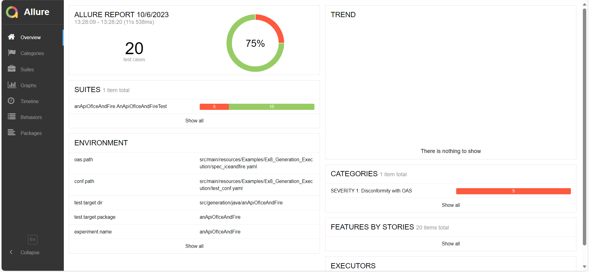

[](https://maven-badges.herokuapp.com/maven-central/es.us.isa/restest)
[](https://javadoc.io/doc/es.us.isa/restest)
[](https://circleci.com/gh/isa-group/RESTest)
[](https://sonarcloud.io/component_measures?id=isa-group_RESTest&metric=Coverage)
[](https://sonarcloud.io/component_measures?id=isa-group_RESTest&metric=Maintainability)
[](https://sonarcloud.io/component_measures?id=isa-group_RESTest&metric=Reliability)
[](https://sonarcloud.io/component_measures?id=isa-group_RESTest&metric=Security)

RESTest is a framework for automated black-box testing of RESTful web APIs. It follows a model-based approach, where test cases are automatically derived from the [OpenAPI Specification (OAS)](https://www.openapis.org/) of the API under test. No access to the source code is required, which makes it possible to test APIs written in any programming language, running in local or remote servers.

## Index
1. [RESTest Wiki](https://github.com/isa-group/RESTest#restest-wiki)

2. [Quick examples](https://github.com/isa-group/RESTest#quick-examples)
   1. [Using the system programmatically](https://github.com/isa-group/RESTest#using-the-system-programmatically)
      1. [Generating test cases](https://github.com/isa-group/RESTest#generating-test-cases)
      2. [Generating and running test cases](https://github.com/isa-group/RESTest#generating-and-running-test-cases)
      3. [Generating and running test cases](https://github.com/isa-group/RESTest#running-test-cases)
   2. [Using the system via the command-line interface](https://github.com/isa-group/RESTest#using-the-system-via-the-command-line-interface)
      1. [Generate, Execute, and Generate Reports based on OpenAPI specification](https://github.com/isa-group/RESTest#generate,-execute,-and-generate-reports-based-on-openapi-specification)
      2. [Create a Test Configuration File](https://github.com/isa-group/RESTest#create-a-test-configuration-file)
      3. [Generate Test Cases](https://github.com/isa-group/RESTest#generate-test-cases)
      4. [Execute Test Cases](https://github.com/isa-group/RESTest#execute-test-cases)
      5. [Generate and Execute Test Cases](https://github.com/isa-group/RESTest#generate-and-execute-test-cases)
3. [How does it work?](https://github.com/isa-group/RESTest#how-does-it-work)
4. [What can I do with RESTest?](https://github.com/isa-group/RESTest#what-can-i-do-with-restest)
5. [Running RESTest as a JAR](https://github.com/isa-group/RESTest#running-restest-as-a-jar)
   1. [Option 1: Build RESTest from source](https://github.com/isa-group/RESTest#option-1-build-restest-from-source)
   2. [Option 2: Download the latest release](https://github.com/isa-group/RESTest#option-2-download-the-latest-release)
6. [Citing RESTest](https://github.com/isa-group/RESTest#citing-restest)
7. [License](https://github.com/isa-group/RESTest#license)
   1. [Icon credits](https://github.com/isa-group/RESTest#icon-credits)

## RESTest Wiki
In this page you can find a brief description of how RESTest works and an illustrating example. If you want to read the full documentation, please visit the [Wiki](https://github.com/isa-group/RESTest/wiki).


## Quick examples:

### Using the system programmatically

#### Generating test cases 

In this example, we illustrate how to generate a set of test cases using the Constraint-Based test case generator and write them to a file using the RESTAssured writer. Test cases are generated by randomly selecting values for each input parameter, ensuring that dependencies between parameters are met (or intentionally violated). This is made possible through the use of a constraint solver (Choco) and IDL, a domain-specific language for specifying dependencies between parameters as part of the OAS specification.

The complete code of the example is provided above.

```java 
public class Ex3_CBTGeneration {

    public static String propertyFilePath="src/main/resources/Examples/Ex3_CBTGeneration/user_config.properties"; 		// Path to user properties file with configuration options

    public static void main(String[] args) throws RESTestException {
        // Load properties
        RESTestLoader loader = new RESTestLoader(propertyFilePath);

        // Create test case generator
        ConstraintBasedTestCaseGenerator generator = (ConstraintBasedTestCaseGenerator) loader.createGenerator();
        Collection<TestCase> testCases = generator.generate();

        // Create target directory for test cases if it does not exist
        createDir(loader.getTargetDirJava());

        // Write (RestAssured) test cases
        RESTAssuredWriter writer = (RESTAssuredWriter) loader.createWriter();
        writer.write(testCases);

        System.out.println(testCases.size() + " test cases generated and written to " + loader.getTargetDirJava());
    }
}

```

This code demonstrates how to load the properties, create a constraint-based test case generator, generate test cases, and write them using the RESTAssured writer. Now, let's examine one of the test cases generated using RESTAssured.
```java

import io.restassured.RestAssured;
import io.restassured.response.Response;
import org.junit.Test;
import static org.junit.Assert.fail;

public class Ex3_CBTGeneration {

   // ... Previous code ...

   @Test
   public void test_qec4n4cuyvcj_getMultiHotelOffers() {
      String testResultId = "test_qec4n4cuyvcj_getMultiHotelOffers";

      // Filter settings for specific test case
      nominalOrFaultyTestCaseFilter.updateFaultyData(true, true, "individual_parameter_constraint:Violated 'min' constraint of integer parameter radius");
      statusCode5XXFilter.updateFaultyData(true, true, "individual_parameter_constraint:Violated 'min' constraint of integer parameter radius");
      csvFilter.setTestResultId(testResultId);
      statusCode5XXFilter.setTestResultId(testResultId);
      nominalOrFaultyTestCaseFilter.setTestResultId(testResultId);
      validationFilter.setTestResultId(testResultId);

      try {
         // Build and send request using RestAssured
         Response response = RestAssured
                 .given()
                 .queryParam("page[limit]", "25")
                 .queryParam("amenities", "BABY-SITTING,AIR_CONDITIONING")
                 .queryParam("hotelIds", "HSFELAAF")
                 .queryParam("roomQuantity", "5")
                 .queryParam("chains", "WV,EC,WW")
                 .queryParam("includeClosed", "false")
                 .queryParam("radius", "-3")
                 .queryParam("radiusUnit", "MILE")
                 .queryParam("checkInDate", "2023-11-14")
                 .queryParam("rateCodes", "WKD,STP,TUR")
                 .queryParam("paymentPolicy", "DEPOSIT")
                 .filter(allureFilter)
                 .filter(statusCode5XXFilter)
                 .filter(nominalOrFaultyTestCaseFilter)
                 .filter(validationFilter)
                 .filter(csvFilter)
                 .when()
                 .get("/shopping/hotel-offers");

         // Verify the response
         response.then();
         System.out.println("El caso de prueba pasó exitosamente.");
      } catch (RuntimeException ex) {
         System.err.println(ex.getMessage());
         fail(ex.getMessage());
      }
   }
}
```

#### Running test cases 
This example will illustrate how to execute a set of tests that have been previously generated using ResTestExecutor. Below is an example of how this process would be carried out.
```
public class Ex8_TestExecution {


    public static final String PROPERTY_FILE_PATH = "src/main/resources/Examples/Ex8_TestExecution/user_config.properties"; 		// Path to user properties file with configuration options

    public static void main(String[] args) throws RESTestException {

        // Execute tests

        RESTestExecutor executor = new RESTestExecutor(PROPERTY_FILE_PATH);
        executor.execute();


    }
}
```


#### Generating and running test cases
In this example, we will explore the generation and execution of test cases using RESTestRunner, a tool that enables the creation of an automated workflow to manage the entire testing process. Below is an example illustrating how this workflow would be executed.

```java

public class Ex9_Generation_Execution {

   public static final String PROPERTY_FILE_PATH = "src/main/resources/Examples/Ex9_Generation_Execution/user_config.properties"; 		// Path to user properties file with configuration options

   public static final Logger logger = Logger.getLogger(Ex9_Generation_Execution.class.getName());

   public static void main(String[] args) throws RESTestException {
      // Load properties
      RESTestRunner runner = new RESTestRunner(PROPERTY_FILE_PATH);

      // Run workflow
      runner.run();

      if (logger.isLoggable(java.util.logging.Level.INFO)) {
         String message1 = String.format("%d test cases generated and written to %s", runner.getNumberOfTestCases(), runner.getTargetDirJava());
         String message2 = String.format("Allure report available at %s", runner.getAllureReportsPath());
         String message3 = String.format("CSV stats available at %s/%s", PropertyManager.readProperty("data.tests.dir"), runner.getExperimentName());
         String message4 = String.format("Coverage report available at %s/%s", PropertyManager.readProperty("data.coverage.dir"), runner.getExperimentName());
         logger.info(message1);
         logger.info(message2);
         logger.info(message3);
         logger.info(message4);
      }

   }
}


```

Upon completion, the program will display detailed information in the console. This will include the number of generated test cases, the location of Allure reports, CSV statistics, and the coverage report, providing a comprehensive overview of the results obtained during the execution.

Finally, test failures are collected and they can be easily spotted and analyzed in a user-friendly GUI, built with [Allure](http://allure.qatools.ru/). To do so, open the file `src/main/resources/Examples/Ex8_Generation_Execution/allure_report/anApiOfIceAndFire/index.html` in your browser:



### Using the system via the command-line interface

The RESTest CLI supports various options for interacting with the system. Here are the available options: 

* **-h, --help:** Display help information about available options and usage. 
* **-o, --openapi [path]:** Generates and executes a series of tests based on an OpenAPI file. 
* **-c, --create-conf [path]:** Generate a test configuration file from the provided OpenAPI file. 
* **-g, --generate [path]:** Generate test cases based on the provided configuration file. 
* **-e, --execute [path]:** Execute the test cases defined in the provided configuration file. 

Here are some quick examples of using the RESTest CLI: 

#### Generate, Execute, and Generate Reports based on OpenAPI specification: 

```
java -jar .\target\restest-cli.jar -o [path_to_oas_file] 
```
  

#### Create a Test Configuration File: 

```
java -jar .\target\restest-cli.jar -c [path_to_oas_file] 
```
  

#### Generate Test Cases: 

```
java -jar .\target\restest-cli.jar -g [path_to_properties_file] 
```
  

#### Execute Test Cases: 

```
java -jar .\target\restest-cli.jar -e [path_to_properties_file] 
```
  

#### Generate and Execute Test Cases: 

```
java -jar .\target\restest-cli.jar -g -e [path_to_properties_file]
```


## Detailed example

In this section, we will delve into a specific example to illustrate in detail how RESTEST operates. Throughout the following steps, we will break down a practical scenario, providing step-by-step explanations of how the system functions.

In this example, we will conduct tests on the Ice and Fire API using RESTest. To perform these tests, we will rely on the OpenAPI specification of the API, which is available at the following [link](src/main/resources/Examples/Ex10_Iterative_Generation_Execution/spec_iceandfire.yaml).

In the next step, we will proceed to obtain the configuration file that will encompass all the essential settings for our tests. This file plays a fundamental role as it sets key parameters, such as the types of generators to use, specific configurations for the Ice and Fire API, and any other relevant information for the successful execution of tests with RESTest.
This is the configuration file for this example:

```yaml
---
auth:
  required: true
  queryParams: {}
  headerParams: {}
  apiKeysPath: null
  headersPath: null
testConfiguration:
  operations:
  - testPath: /api
    operationId: getRoot
    method: get
    testParameters: null
    expectedResponse: 200
  - testPath: "/api/books/{book-id}"
    operationId: findBookById
    method: get
    testParameters:
    - name: book-id
      in: path
      weight: null
      generators:
      - type: RandomNumber
        genParameters:
        - name: type
          values:
          - integer
          objectValues: null
        - name: min
          values:
          - 1
          objectValues: null
        - name: max
          values:
          - 100
          objectValues: null
        valid: true
    expectedResponse: 200
  - testPath: "/api/characters/{character-id}"
    operationId: findCharacterById
    method: get
    testParameters:
    - name: character-id
      in: path
      weight: null
      generators:
      - type: RandomNumber
        genParameters:
        - name: type
          values:
          - integer
          objectValues: null
        - name: min
          values:
          - 1
          objectValues: null
        - name: max
          values:
          - 100
          objectValues: null
        valid: true
    expectedResponse: 200
  - testPath: "/api/houses/{house-id}"
    operationId: findHouseById
    method: get
    testParameters:
    - name: house-id
      in: path
      weight: null
      generators:
      - type: RandomNumber
        genParameters:
        - name: type
          values:
          - integer
          objectValues: null
        - name: min
          values:
          - 1
          objectValues: null
        - name: max
          values:
          - 100
          objectValues: null
        valid: true
    expectedResponse: 200

```


The following [link](src/main/java/es/us/isa/restest/examples/Ex2_CreateTestConf.java) provides an example of how we can obtain this configuration file.

Once we have both files, the OAS specification, and the configuration file, we will create a new .properties file in which we will specify the path where these files are located, along with other configurations for the generation and execution of tests. This file looks like the following:
````java

# OAS specification
oas.path=src/main/resources/Examples/Ex9_Iterative_Generation_Execution/spec_iceandfire.yaml

# Test configuration file
conf.path=src/main/resources/Examples/Ex9_Iterative_Generation_Execution/test_conf.yaml

# Directory where the test cases will be generated
test.target.dir=src/generation/java/anApiOfIceAndFire

# Package name
test.target.package=anApiOfIceAndFire

# Experiment name (for naming related folders and files)
experiment.name=anApiOfIceAndFire

# Set true for running the generated test cases
experiment.execute=true

# Name of the test class to be generated
testclass.name=AnApiOfIceAndFireTest

# Ratio of faulty test cases to be generated doe to broken individual dependencies (ex. missing required parameter). Helpful for negative testing
faulty.ratio=0.05

# Number of test cases to be generated per operation
testsperoperation=5

# Maximum number of test cases to be generated (approximately)
numtotaltestcases=100

# Delay between requests in seconds (-1 for no delay)
delay=30

# Set to true for validating the test cases with OASValidator before executing them
testcases.check=true


# =================================
# CONSTRAINT-BASED TESTING (CBT)
# =================================

# Test case generator
generator=CBT

# Ratio of faulty test cases to generate due to the violation of inter-parameter dependencies
faulty.dependency.ratio=0.4

# Number of requests using the same randomly generated input data
reloadinputdataevery=10

# Number of values used for each parameter when reloading input data
inputdatamaxvalues=100

# =================
# ALLURE REPORTS
# =================

# Set to true for generating Allure reports
allure.report=true

# Path to the directory where Allure will save the report
allure.report.dir=src/main/resources/Examples/Ex9_Iterative_Generation_Execution/allure_report

# ==================
# CSV STATS REPORTS
# ==================

# Set to true for generating CSV stats
stats.csv=true

# ===================
# COVERAGE REPORTS
# ===================

# Set to true for computing input coverage
coverage.input=true

# Set to true for computing output coverage
coverage.output=true

# Path to the directory where coverage results will be saved
data.coverage.dir=target/coverage-data


````

Once we have this file, we will be ready to carry out the generation and execution of our tests. To achieve this, we will use the following example as a guide:

```java

public class Ex9_Generation_Execution {

   public static final String PROPERTY_FILE_PATH = "src/main/resources/Examples/Ex9_Generation_Execution/user_config.properties"; 		// Path to user properties file with configuration options

   public static final Logger logger = Logger.getLogger(Ex9_Generation_Execution.class.getName());

   public static void main(String[] args) throws RESTestException {
      // Load properties
      RESTestRunner runner = new RESTestRunner(PROPERTY_FILE_PATH);

      // Run workflow
      runner.run();

      if (logger.isLoggable(java.util.logging.Level.INFO)) {
         String message1 = String.format("%d test cases generated and written to %s", runner.getNumberOfTestCases(), runner.getTargetDirJava());
         String message2 = String.format("Allure report available at %s", runner.getAllureReportsPath());
         String message3 = String.format("CSV stats available at %s/%s", PropertyManager.readProperty("data.tests.dir"), runner.getExperimentName());
         String message4 = String.format("Coverage report available at %s/%s", PropertyManager.readProperty("data.coverage.dir"), runner.getExperimentName());
         logger.info(message1);
         logger.info(message2);
         logger.info(message3);
         logger.info(message4);
      }

   }
}

```

As we can see, by providing the path where the .properties file is located, the system will create a workflow that will perform the generation of test cases, their execution, and the generation of reports and summaries about the tests. Additionally, after executing the workflow, the following information will be printed on the screen:

* Number of test cases generated and written to a specific location.
* Location of the Allure report.
* CSV stats available at a specific path.
* Coverage report available at another specific path.

These details provide a quick and useful insight into the success and results of the conducted tests, facilitating the tracking and evaluation of the performance of the generated test cases.

## How does it work?
The figure below shows how RESTest works:

1. **Test model generation**: RESTest takes as input the OAS specification of the API under test, considered the *system model*. A [*test model*](https://github.com/isa-group/RESTest/wiki/Test-configuration-files) is automatically generated from the system model including test-specific configuration data. The default test model can be manually enriched with fine-grained configuration details such as test data generation settings.

2. **Abstract test case generation**: The system and the test models drive the generation of abstract test cases following user-defined test case generation strategies such as random testing. If the API under test contains [inter-parameter dependencies](https://github.com/isa-group/RESTest/wiki/Inter-parameter-dependencies), then constraint-based testing can be applied, specifying the dependencies in the OAS specification using the IDL4OAS extension (see examples [here](https://github.com/isa-group/IDLReasoner/blob/master/src/test/resources/OAS_example.yaml#L45) and [here](https://github.com/isa-group/IDLReasoner/tree/master/src/test/resources)). Requests satisfying all inter-parameter dependencies are automatically generated thanks to [IDLReasoner](https://github.com/isa-group/IDLReasoner).

3. **Test case generation**: The abstract test cases are instantiated into a specific programming language or testing framework using a [test writer](https://github.com/isa-group/RESTest/wiki/Test-writers). RESTest currently supports the generation of [REST Assured](http://rest-assured.io/) and [Postman](https://www.postman.com/) test cases.

4. **Test case execution**: The test cases are executed and a set of reports and stats are generated. Stats are machine-readable, and the test reports can be graphically visualized thanks to [Allure](http://allure.qatools.ru/).

5. **Feedback collection**: [Test case generators](https://github.com/isa-group/RESTest/wiki/Test-case-generators) and other components can react to the test outputs (i.e., the stats generated in the previous step) to create more sophisticated test cases. Examples of this are the stateful data generators (e.g., the [BodyGenerator](https://github.com/isa-group/RESTest/blob/master/src/main/java/es/us/isa/restest/inputs/stateful/BodyGenerator.java)) and the [StatsReportManager](https://github.com/isa-group/RESTest/blob/master/src/main/java/es/us/isa/restest/reporting/StatsReportManager.java), both of which generate new test data based on previous API responses.


## What can I do with RESTest?
Check out the following demo video, where we discuss some of the things that you can do with RESTest, both from the user and the developer point of view. The showcase shown in the video is available at http://betty.us.es/restest-showcase-demo/.

<a href="https://youtu.be/TnGkwMDBDt4" target="_blank"></a>

## Running RESTest as a JAR
Instead of from an IDE like IntelliJ IDEA, you can also run RESTest as a fat JAR. You have two options:

### Option 1: Build RESTest from source

To package RESTest as a fat JAR file, run the following command in the root directory:

```
mvn clean install -DskipTests
```

Then, run the JAR file passing as argument the path to the properties file, for example:

```
java -jar target/restest.jar src/test/resources/Restcountries/restcountries_demo.properties
```

### Option 2: Download the latest release

Go to the [releases page](https://github.com/isa-group/RESTest/releases) and download the latest one. RESTest releases consist of ZIP files which, once uncompressed, provide the directory structure and the necessary resources to run RESTest as a JAR. You can test the same example shown in the quickstart guide by running the following command:

```
java -jar restest.jar src/test/resources/Folder/api.properties
```

## Citing RESTest

If you want to cite RESTest in your research, please use the BibTeX entry below. [Here's a link to a preprint of the paper](https://www.researchgate.net/publication/352835570_RESTest_Automated_Black-Box_Testing_of_RESTful_Web_APIs).


```bibtex
@inproceedings{MartinLopez2021Restest,
	title= {{RESTest: Automated Black-Box Testing of RESTful Web APIs}},
	author= {Alberto Martin-Lopez and Sergio Segura and Antonio Ruiz-Cort\'{e}s},
	booktitle= {Proceedings of the 30th ACM SIGSOFT International Symposium on Software Testing and Analysis},
	series= {ISSTA '21},
	publisher= {Association for Computing Machinery},
	year= {2021}
}
```

## License
RESTest is distributed under the [GNU Lesser General Public License v3.0](LICENSE).

RESTest includes Allure Framework &copy; 2019 Qameta Software OÜ. It is used under the terms of the Apache 2.0 License, which can be obtained from http://www.apache.org/licenses/LICENSE-2.0.

### Icon credits
This README and some pages of the Wiki use icons provided by [Freepik](https://www.flaticon.com/authors/freepik), available at [Flaticon](https://www.flaticon.com/).
