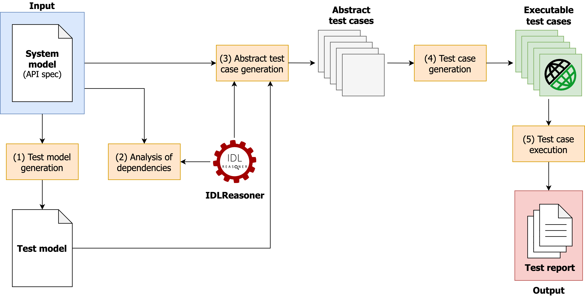

# RESTest
[](https://www.gnu.org/licenses/gpl-3.0)
[](https://travis-ci.com/isa-group/RESTest)
[](https://sonarcloud.io/component_measures?id=isa-group_RESTest&metric=Coverage)
[](https://sonarcloud.io/component_measures?id=isa-group_RESTest&metric=Maintainability)
[](https://sonarcloud.io/component_measures?id=isa-group_RESTest&metric=Reliability)
[](https://sonarcloud.io/component_measures?id=isa-group_RESTest&metric=Security)

RESTest is a framework for automated black-box testing of RESTful web APIs. It follows a model-based approach, where test cases are automatically derived from the [OpenAPI Specification (OAS)](https://www.openapis.org/) of the API under test. No access to the source code is required, which makes it possible to test APIs written in any programming language, running in local or remote servers.

## RESTest Wiki
In this page you can find a brief description of how RESTest works and an illustrating example. If you want to read the full documentation, please visit the [Wiki](https://github.com/isa-group/RESTest/wiki). 

## How does it work?
The figure below shows how RESTest works:

1. **Test model generation**: RESTest takes as input the OAS specification of the API under test, considered the *system model*. A [*test model*](https://github.com/isa-group/RESTest/wiki/Test-configuration-files) is automatically generated from the system model including test-specific configuration data. The default test model can be manually enriched with fine-grained configuration details such as test data generation settings.

1. **Analysis of dependencies**: The OAS specification of the API can optionally describe [inter-parameter dependencies](https://github.com/isa-group/RESTest/wiki/Inter-parameter-dependencies) using the IDL4OAS extension (see examples [here](https://github.com/isa-group/IDLReasoner/blob/master/src/test/resources/OAS_example.yaml#L45) and [here](https://github.com/isa-group/IDLReasoner/tree/master/src/test/resources)). If so, inter-parameter dependencies will be automatically analyzed and leveraged for the generation of test cases.

1. **Abstract test case generation**: The system and the test models drive the generation of abstract test cases following user-defined test case generation strategies such as random testing. In parallel, inter-parameter dependencies, if any, are fed into the tool [IDLReasoner](https://github.com/isa-group/IDLReasoner), providing support for their automated analysis during test case generation, for instance, to check whether an API call satisfies all the inter-parameter dependencies defined in the specification.

1. **Test case generation**: The abstract test cases are instantiated into a specific programming language or testing framework using a [test writer](https://github.com/isa-group/RESTest/wiki/Test-writers). RESTest currently supports the generation of [REST Assured](http://rest-assured.io/) test cases.

1. **Test case execution**: The test cases are executed and a set of reports and statistics are generated. These data are machine-readable, therefore test generation algorithms can react to them and generate more sophisticated test cases (e.g., with search-based approaches).



## Quickstart guide
To get started with RESTest, download the code and move to the parent directory:
````
git clone https://github.com/isa-group/RESTest.git
cd RESTest
````

### Maven configuration
To build and run RESTest, you **MUST** include the dependencies in the `lib` folder on your local Maven repository (e.g., `~/.m2` folder in Mac). You can do it as follows:
```sh
mvn install:install-file -Dfile=lib/JSONmutator.jar -DgroupId=es.us.isa -DartifactId=json-mutator -Dversion=0.0.1-SNAPSHOT -Dpackaging=jar
mvn install:install-file -Dfile=lib/IDL2MiniZincMapper.jar -DgroupId=es.us.isa -DartifactId=idl-2-minizinc-mapper -Dversion=0.0.1-SNAPSHOT -Dpackaging=jar
mvn org.apache.maven.plugins:maven-install-plugin:3.0.0-M1:install-file -Dfile=lib/IDLreasoner.jar
```

### Setting up RESTest

Let's try RESTest with some API, for example, [Bikewise](https://bikewise.org/). Follow these steps:

1. **Get the OAS specification of the API under test**. For Bikewise, it is available at the following path: `src/test/resources/Bikewise/swagger.yaml`.

1. **Generate the test configuration file**. From the OAS spec, we can automatically generate the [test configuration file](https://github.com/isa-group/RESTest/wiki/Test-configuration-files). To do so, run the [CreateTestConf](https://github.com/isa-group/RESTest/blob/master/src/main/java/es/us/isa/restest/main/CreateTestConf.java) class, located under the `es.us.isa.restest.main` package. The test configuration file will be generated in the location `src/test/Bikewise/testConf.yaml`.

1. **(Optional) Modify the test configuration file to tailor your needs**. For example, you can remove some operations you are not interested to test. For more info, visit the [Wiki](https://github.com/isa-group/RESTest/wiki/Test-configuration-files).

1. **Configure RESTest execution**. To set things like number of test cases to generate, testing technique, etc., you need to create a [RESTest configuration file](https://github.com/isa-group/RESTest/wiki/RESTest-configuration-files). You can find the RESTest configuration file for the Bikewise API at `src/test/resources/Bikewise/bikewise.properties`. With this configuration, a total of 40 nominal test cases will be randomly generated, and the test outputs and reports will be stored under the folders `target/<type_of_data>/bikewise_example`:

```properties
# CONFIGURATION PARAMETERS

# Test case generator
generator=CBT

# Number of test cases to be generated per operation on each iteration
testsperoperation=5

# OAS specification
oas.path=src/test/resources/Bikewise/swagger.yaml

# Test configuration file
conf.path=src/test/resources/Bikewise/fullConf.yaml

# Directory where the test cases will be generated  
test.target.dir=src/generation/java/bikewise

# Package name
test.target.package=bikewise

# Experiment name (for naming related folders and files)
experiment.name=bikewise

# Name of the test class to be generated
testclass.name=BikewiseTest

# Measure input coverage
coverage.input=true

# Measure output coverage
coverage.output=true

# Enable CSV statistics
stats.csv=true

# Maximum number of test cases to be generated
numtotaltestcases=40

# Optional delay between each iteration (in seconds)
delay=-1

# Ratio of faulty test cases to be generated (negative testing)
faulty.ratio=0

# CONFIGURATION SETTINGS FOR CONSTRAINT-BASED TESTING

# Ratio of faulty test cases to be generated due to broken dependencies.
faulty.dependency.ratio=0

# Number of test cases after which new test data will be loaded.
reloadinputdataevery=10

# Max number of data values for each parameter
inputdatamaxvalues=10
```

5. **Run RESTest**. Edit [the following line of TestGenerationAndExecution](https://github.com/isa-group/RESTest/blob/master/src/main/java/es/us/isa/restest/main/TestGenerationAndExecution.java#L36) to set the path to the RESTest configuration file. Then, run the [TestGenerationAndExecution](https://github.com/isa-group/RESTest/blob/master/src/main/java/es/us/isa/restest/main/TestGenerationAndExecution.java) class, located under the `es.us.isa.restest.main` package.

````java
setEvaluationParameters("src/test/resources/Bikewise/bikewise.properties");
````

### Generated test cases and test reports

RESTest generates REST Assured test cases like the following one:

```java
@Test
public void test_1jylmdhlbau76_GETversionincidentsformat() {
	String testResultId = "test_1jylmdhlbau76_GETversionincidentsformat";

	NominalOrFaultyTestCaseFilter nominalOrFaultyTestCaseFilter = new NominalOrFaultyTestCaseFilter(false, false, "none");

	try {
  	Response response = RestAssured
		.given()
			.log().all()
			.queryParam("incident_type", "unconfirmed")
			.queryParam("proximity", "whine")
			.queryParam("occurred_after", "36")
			.queryParam("query", "camper")
			.queryParam("page", "18")
			.filter(new CSVFilter(testResultId, APIName))
			.filter(allureFilter)
			.filter(statusCode5XXFilter)
			.filter(nominalOrFaultyTestCaseFilter)
			.filter(validationFilter)
		.when()
			.get("/v2/incidents");

		response.then().log().all();
		System.out.println("Test passed.");
	} catch (RuntimeException ex) {
		System.err.println(ex.getMessage());
		fail(ex.getMessage());
	}	
}
```

This test case makes a GET request to the endpoint `/v2/incidents` with several query parameters. Then it asserts that:
  - The status code is not 500 or higher (server error).
  - The status code is in the range 2XX if the request is valid or 4XX if the request is faulty.
  - The response conforms to the OAS specification of the API.

Finally, test failures are collected and they can be easily spotted and analyzed in a user-friendly GUI, built with [Allure](http://allure.qatools.ru/). To do so, open the file `target/allure-reports/bikewise_example/index.html` in your browser:


## Running RESTest as a JAR
You can also package RESTest as a JAR file and run it from command line. To do so, first create the JAR:

```
mvn clean install -DskipTests
```

Then, run the JAR file passing as argument the path to the properties file, for example:

```
java -jar target/restest-full.jar src/test/resources/Bikewise/bikewise.properties
```

## License
RESTest is distributed under the [GNU General Public License v3.0](LICENSE).

RESTest includes Allure Framework &copy; 2019 Qameta Software OÜ. It is used under the the terms of the Apache 2.0 License, which can be obtained from http://www.apache.org/licenses/LICENSE-2.0.

RESTest also includes MiniZinc &copy; 2014-2020 Monash University and Data61, CSIRO. Its source code is available from [GitHub](https://github.com/MiniZinc/libminizinc) under the MPL 2.0 License, which can be obtained from https://www.mozilla.org/en-US/MPL/2.0.
